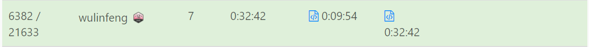
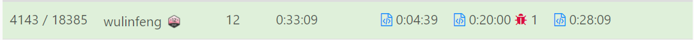
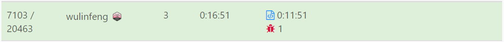

# 周赛记录

在这里记录一下leetcode周赛的记录，算法笔记在wulinfeng953.gitbook.com，算法排名在https://clist.by/coder/wulinfeng/

## contest 280

这周实在是有点尴尬，第一题没啥说的，第二题找max和second max非常好想但是里面的corner case没有弄好，用一个数字来track的原始方法实在是很容易出错，最后回想起来还不如直接排序做，然后就做出来了，第三题也很简单是prefixsum的题型，但是忽略了乘法

溢出，直接在乘法前面加个long就可以了，第四题是个挺难的题，看起来能够暴力解出来，但是现在我还没搞明白暴力解法需要的复杂度是多少，是一道位掩码加上dp的题目，我看到解法巧妙的利用了0&任意数都为0的结论把原来的数组补齐的操作非常巧妙

## contest 279

第一题第二题比较直给，第三题其实也非常简单，题目已经提示是bitset所以用位运算是错误的，而且取值为10^5，即使用大数也不可能完成

第四题在第四题中也比较简单思路就是每次走一格的长度和跳着取得值相比较，跳着取放在dp数组当中，其实这道题也是读题问题导致没有做完，两边dp完成后找到最小的值

## contest 278

第一题第二题比较直给，考察数据结构map和前缀和

第三题后面改成了hard，是一道Rolling hash的问题，解法上并没有什么高深的地方，取模的过程卡住了非常长的时间，实际上如果有除法的取模操作，从后向前应该是基本的sense，只不过取模的题做的还少，以后需要加强

第四题用到了遍历所有可能的方法，不仅用到了bitmap还有合并集，遍历所有可能的邻接可能，再用unionfind连接起来，值得一说是unionfind的find方法parent[n] = find(parent[n])，可以有效地减小时间复杂度将合并集树压缩

## contest 277

前三题都比较简单，第四题需要一些小技巧，这个技巧在以往的周赛中也用过很多次，就是在一般遍历所有值复杂度较大时候，可以用列出可能性然后再判断每个值时候符合这种情况，通常和bitmap配合使用，在这道题里面也就是用bitmap模拟出所有真假情况然后进行判断

## contest 276

第一题分割一个string为k组没什么可说的，但是居然还出错了一次实在不应该

第二题贪心没看出来，用了dp半天总是超时，其实看到数据范围就知道不应该用了，再数字越大的时候用乘法越快

第三题从后向前dp，也正在总结什么情况下反向dp更好一点，总之这道题的问题是从小至大的dependency是没法确定的因为每个位置上的数休息的时间不同所以需要遍历之前的所有点，但是从后向前则不用，因为能够确定取到的最近位置是确定的

第四题没做 大抵就是sort整个数组然后 如果是平均分配的话upbounding是总数除掉个数，该数组中的最大位数大概就是偏离值最大的，不断对总和减掉这个值直到达到upbounding数学题

总的来说 dp的分类没有总结好,每次想出暴力解决方法后，很难往下想优化面但是这次周赛应该能做出来三道题的只做出一道还是需要想想状态问题
